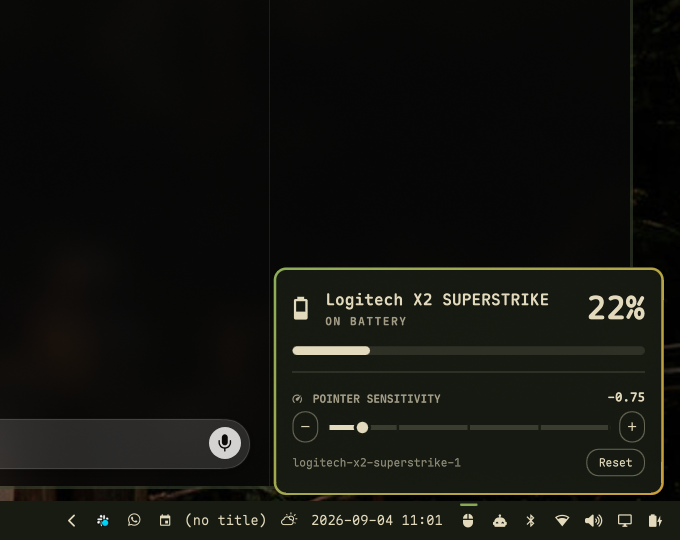

# leonavas.mouse

A bar widget for the Omarchy shell: the wireless mouse's battery level in the
bar, and a pointer-sensitivity slider behind a right click.



## What it does

- **Battery in the bar.** The charge level of the wireless mouse, read from
  UPower — which the kernel's HID++ driver feeds for Logitech's wireless mice.
  Optionally with the percentage next to the glyph.
- **A low warning.** One notification per discharge when it drops below the
  threshold, re-armed once the mouse is charged back above it.
- **A sensitivity slider.** Hyprland's pointer sensitivity, from -1 (slowest)
  to +1 (fastest), with `−` and `+` buttons at the ends of the track that step
  by 0.05. Applied live as you drag, so the pointer answers under your hand.
- **Scoped to the mouse.** By default the slider writes a Hyprland *per-device*
  rule, so the touchpad and any second pointer keep whatever `input.lua` gave
  them. It can be pointed at the global `input:sensitivity` instead.

## Interactions

| Gesture | What it does |
|---|---|
| Right click | Opens the panel — the gesture the widget was built for |
| Left click | Opens the panel too, because every other bar widget does |
| Middle click | Toggles the percentage next to the glyph |
| Wheel | Steps sensitivity by 0.05 without opening anything |
| `←` `→` in the panel | Steps sensitivity |
| `Esc` | Closes the panel |

## How the two halves find each other

The battery and the slider look unrelated, and they come from different places:
the level from UPower over D-Bus, the sensitivity into Hyprland as a config
write. They meet in the device name.

Hyprland lists everything that can move a cursor under `mice` — a keyboard's
pointer descriptor and the laptop touchpad sit in the same list as the mouse,
and it disambiguates same-named devices with a `-1` suffix that shifts as
devices come and go. So the pointer is not guessed from that list alone: it is
scored against the model string of the battery UPower is reporting, and the
name sharing the most tokens with it wins. The battery and the pointer are the
same physical mouse, which is what makes the match hold.

If the guess is wrong — two mice, or a mouse with no battery to match against —
set **Hyprland device to write to** to a name from `hyprctl devices`.

## Why it writes Lua

Omarchy configures Hyprland through the Lua parser, and that parser refuses the
usual runtime path:

```
$ hyprctl keyword 'device[my-mouse]:sensitivity' -0.3
keyword can't work with non-legacy parsers. Use eval.
```

So every write goes out as `hyprctl eval 'hl.device({ name = ..., sensitivity = ... })'`.
Device names come from HID descriptors — data, never code — so the name is
wrapped in a Lua long-bracket literal, which has no escapes and no
interpolation, and a name that could close that bracket is refused rather than
escaped. The command is handed over as argv, so no shell ever sees it either.

One consequence: `hyprctl eval` writes *live* config state, and every config
reload throws that away — Omarchy reloads on theme changes and on any save
under `~/.config/hypr`. The widget listens for Hyprland's `configreloaded`
event and re-asserts the value, so the slider does not quietly lose its
setting a few times a day.

## Settings

Set these in Setup > Plugins, or inline on the widget's entry in
`~/.config/omarchy/shell.json`.

| Key | Default | What it does |
|---|---|---|
| `glyph` | `󰍽` | Bar glyph while a battery is being reported |
| `absentGlyph` | `󰍾` | Bar glyph while the mouse is off, asleep, or wired |
| `showPercentage` | `false` | Percentage next to the glyph (middle click toggles it) |
| `hideWhenAbsent` | `false` | Drop the icon from the bar when no battery is reported |
| `dimWhenAbsent` | `true` | Dim the icon instead of dropping it |
| `tintWhenLow` | `true` | Paint the icon in the theme's urgent colour when low |
| `lowThreshold` | `15` | Low battery below this percentage |
| `notifyLow` | `true` | One notification per discharge |
| `scope` | `This mouse` | `This mouse` (per-device rule) or `All pointers` (`input:sensitivity`) |
| `deviceName` | `""` | Pin the Hyprland device instead of guessing it |
| `sensitivity` | absent | The value the slider last set. Absent means the mouse follows the global setting — the panel's **Reset** button puts it back there |

A reading of `0%` is treated as *no reading yet*, not a flat mouse: UPower
publishes the device as soon as the receiver sees it and the HID++ level
arrives afterwards, so every reconnect passes through zero. A mouse that really
is at zero is off, and off means no device at all.

## Requirements

- Hyprland, configured through Omarchy's Lua config (the `hl.*` API)
- UPower, and a mouse whose battery it reports — `upower -e` should list a
  device such as `battery_hidpp_battery_0`
- `notify-send`, for the low-battery warning only

The sensitivity half works on any pointer Hyprland can name, with or without a
battery. The battery half needs UPower to see the mouse; a wired mouse has
nothing to report.

## Troubleshooting

```bash
# Which pointer is the slider writing to?
omarchy-shell leonavas.mouse pointer

# What is it reading?
omarchy-shell leonavas.mouse battery
omarchy-shell leonavas.mouse sensitivity

# Nothing in the bar? Ask what UPower is actually publishing.
omarchy-shell leonavas.mouse debugDevices

# Re-assert the stored sensitivity by hand.
omarchy-shell leonavas.mouse reapply
```

## Install

```bash
omarchy plugin add https://github.com/leonavas/omarchy-mouse.git
omarchy plugin enable leonavas.mouse --section right
```

The widget lands in the bar's right section; `omarchy bar move leonavas.mouse
--section center` puts it elsewhere.

## Remove

```bash
omarchy plugin disable leonavas.mouse   # off the bar, files kept
omarchy plugin remove leonavas.mouse    # deletes ~/.config/omarchy/plugins/leonavas.mouse/
```

Disabling drops the widget's entry — and with it the stored sensitivity — from
`~/.config/omarchy/shell.json`. Nothing is left behind in `~/.config/hypr/`,
because the widget never writes there: the sensitivity it applied lives only in
Hyprland's live config state, which the next config reload discards. To hand the
pointer back immediately, press **Reset** in the panel before removing the
plugin, or run `hyprctl reload config-only` afterwards.

## What it writes

- `~/.config/omarchy/shell.json` — its own widget entry only, through the
  shell's own `updateEntryInline` settings mechanism, and only in response to a
  deliberate action: dragging the slider, pressing `−`/`+`, the wheel, or a
  middle click. No other key and no other plugin's entry is touched.
- **Hyprland's live config state**, through `hyprctl eval`. Your
  `~/.config/hypr/*.lua` files are never read for writing and never modified,
  so the value you set in `input.lua` stays the value Hyprland falls back to.
  At startup and after a config reload the widget re-asserts only a sensitivity
  you had already set yourself.

Nothing else is written, nothing is read from the network, and no sudo or pkexec
is required. External commands used: `hyprctl` and `notify-send`.

## License

MIT — see [LICENSE](LICENSE).
